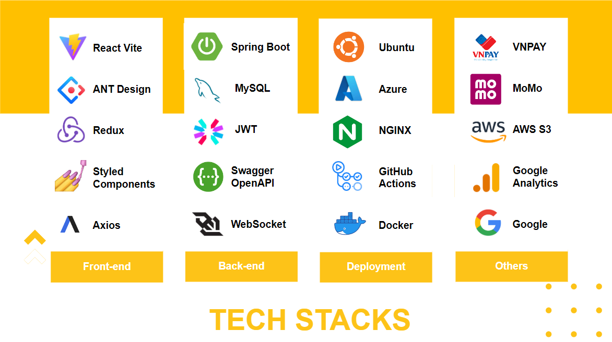
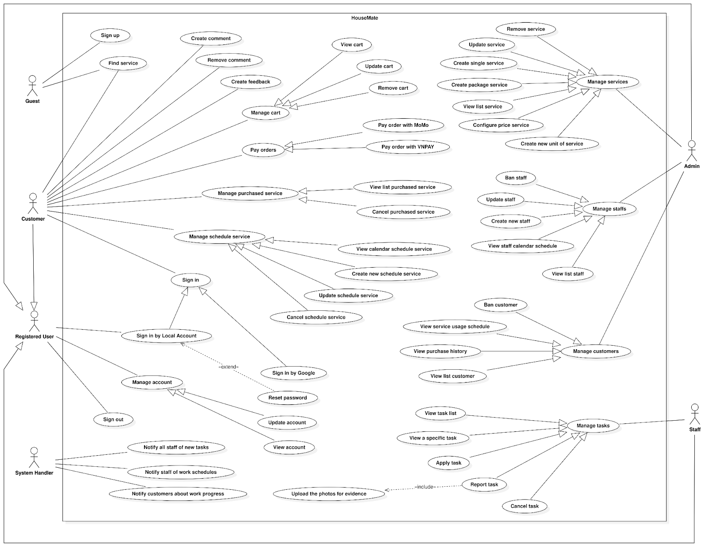
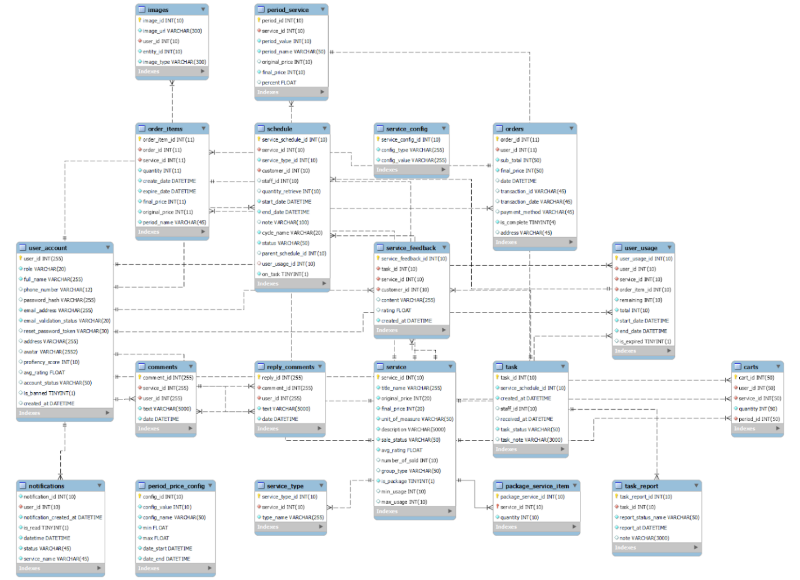

# HouseMate - Student House Membership Cart

<div align="center">
    
    <p>HouseMate is a web application that provides service for student apartments.</p>
</div>

## 0. Introduction

The software system provides service packages for student apartments. Each apartment will purchase pre-designed service packages. Each package may include: cleaning, sanitation, water delivery... Each service package has constraints on usage time, repetition period, number of services per cycle... When used up Services in the package can still be ordered, the price of the additional service depends on the type of service package purchased.
+ Admin can manage individual services, service packages (including individual services)...
+ Staff performs work and updates results of services
+ Customer orders and tracks used services

## 1. Techstacks



## 2. Installation

Clone the repository:

```bash
git clone https://github.com/hdang09/HouseMate-Frontend
```

Change direction to the folder:

```bash
cd HouseMate-Frontend
```

Install the dependencies:

```bash
yarn
```

Set the environment variables:

```bash
cp .env .env.development

# open .env.development and modify the environment variables
```

## 3. Environment Variables

```bash
VITE_API_URL = [YOUR_API_URL]
```


## 4. Use case diagram



## 5. Database Design



## 6. Team members

-  [Tran Hai Dang](https://github.com/hdang09): Project Leader, Front-end Leader, Back-end Developer
-  [Lam Thi Ngoc Han](https://github.com/khanhlinh2601): Front-end Developer, UI/UX Designer
-  [Duong Hoang Nam](https://github.com/nghia14302): Front-end Developer
-  [Tran Tan Thanh](https://github.com/oHTGo): Back-end Leader
-  [Nguyen Hoang Anh](https://github.com/oHTGo): Back-end Developer